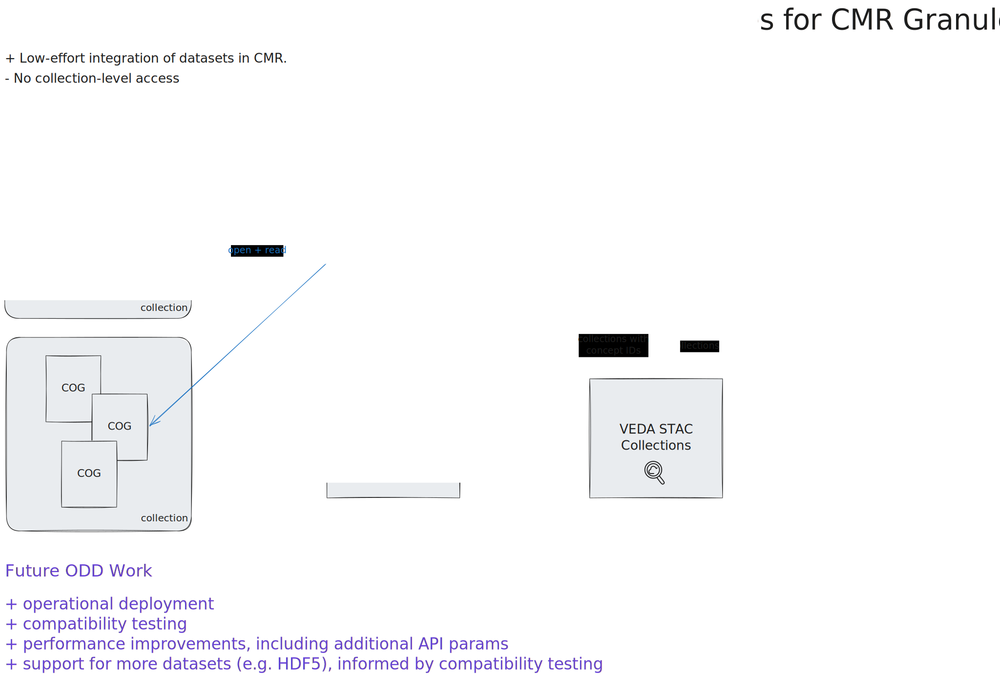
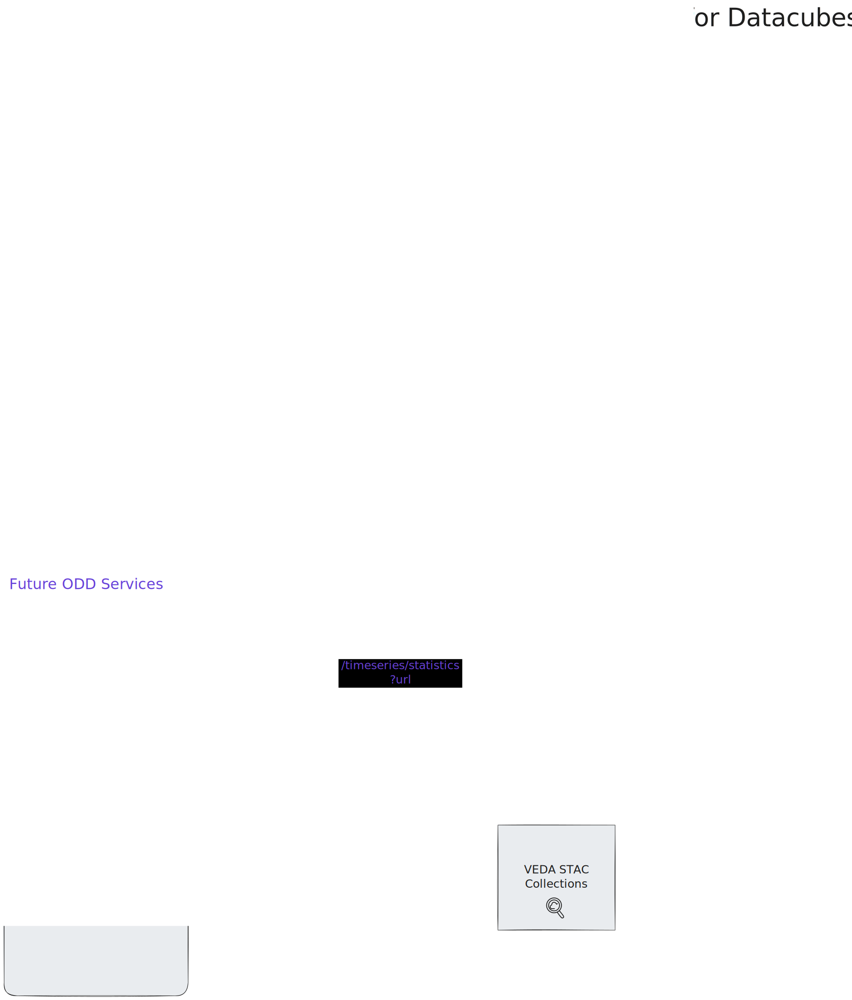

# ODD Fiscal Year (FY) 2026 Roadmap

If you are interested in a better understanding of the ODD service roadmap, and what datasets will be supported when, this document is for you.

This document provides a roadmap for the VEDA Optimized Data Delivery Team (ODD), broken into 4 categories:
1. Services for granules in CMR
2. Services for datacubes
3. Services non-datacube
4. Foundational Work

It is important to note that this roadmap is a reflection of the team's current plans, written as of November 2025. These are likely to evolve over time. We intend to update the roadmap quarterly.

For a higher-level vision, see also: [Optimized Data Delivery Roadmap for NASA - July 2025](https://docs.google.com/presentation/d/1Ouo_9qJJuDBdrzDHpt2P-o1wGBPS1nvTjLRFAFGsYkU/edit?usp=sharing).

---

## Legend

- **✅ Complete** - Already delivered
- **🚧 In Progress** - Active development
- **🔄 Ongoing** - Ongoing work
- **📅 Planned** - Scheduled for specific quarter
- **🔮 Future** - Planned for future timeline

---

## Roadmap for Service Category 1: Services for CMR Granules

### Access
*N/A*

### Visualization
- **✅ Complete** titiler-cmr /tiles API + VEDA UI integration

### Timeseries
- **✅ Complete** titiler-cmr /timeseries/statistics API + VEDA UI integration

### Additional Features
- **🚧 26.1** Release /compatibility endpoint
- **📅 26.2+** Develop support for more datasets, informed by compatibility testing in 26.1.

### Dataset Support
- **✅ Complete** Demonstrated with GPM IMERG, TROPESS O3 and MiCASA
- **🚧 26.1** Compile a list of compatible datasets
- **🚧 26.1** Develop support for EDL-based credential access, as an aternative to requester-pays and role-based access. To support NISAR (ASF) and GEDI L4B (ORNL DAAC) specifically.
- **📅 26.2+** Test integration of new datasets as requester-pays is enabled for more buckets.

### Performance + Operations
- **🚧 26.1** Deploy monitoring + performance evaluation via service tracing (OpenTelemetry)
- **📅 26.1** MCP Production deployment
- **📅 26.2** Consolidated benchmarking utilities for advising users on zoom levels, AOIs and temporal parameters on a per-dataset basis

### Ecosystem Development
- **📅 26.2** Share compatible dataset list with NASA product teams for potential integration (i.e. Worldview)
- **📅 26.2+** Continued documentation to support self-service use of titiler-cmr.

---

## Roadmap for Service Category 2: Services for Datacubes

### Access
- **✅ Complete** Lazy loading/intelligent subsetting/intelligent access for varied data formats (GRIB, COG, NetCDF-4, HDF5 via VirtualiZarr)
- **📅 26.1** Support adoption of Virtual Zarr through library maintenance, improved documentation, and user support
- **📅 26.2** Support for arbitrary [chunk-grids (variable chunking)](https://zarr-specs.readthedocs.io/en/latest/v3/core/index.html#chunk-grids)
- **📅 26.2** Explore virtualization methods for alternate grid structures (i.e., healpix, cubegrid)

### Visualization
- **📅 26.1** Virtual container (Icechunk) integration in titiler-multidim to support /tiles endpoints
- **📅 26.1** Identify additional I/O parameters to allow for per-dataset optimizations
- **📅 26.1** Test VEDA UI integration of /tiles for a virtual dataset (e.g. NLDAS)
- **📅 26.2** Additional performance improvements (e.g. obstore integration)

### Timeseries
- **📅 26.1** Design the timeseries/statistics endpoint to support datacubes (i.e. could be an asynchronous API outside the titiler ecosystem)
- **📅 26.2** Develop the timeseries/statistics endpoint
- **📅 26.2** Integrate the timeseries/statistics endpoint into VEDA UI

### Datasets
- **✅ Complete** Prototyped virtual (Icechunk) stores for NLDAS, RASI, HRRR, MUR SST
- **📅 26.1** Demonstrate publication and tiling of NLDAS virtual store (💧 Water Insight)
- **📅 26.1** Architecture + documentation for generalizing STAC publication and VEDA UI /tiles integration
- **📅 26.2** HydroGlobe 5km and 10km virtual stores (💧 Water Insight)
- **📅 26.2** CarbonTracker-CH₄, EPA Gridded CH₄ Emissions Inventory virtual stores (🏭 GHGCenter)
- **📅 26.3** Documentation for STAC publication and VEDA UI /timeseries/statistics integration
- **📅 26.3** CarbonTracker-CH₄, EPA Gridded CH₄ Emissions Inventory tiles and timeseries integrations (🏭 GHGCenter)
- **📅 26.3** TROPESS NOx, TROPESS O3, JPL MOMO Chem, GEOS CF virtual stores, tiles and timeseries integrations (💨 Air Quality)

### Operations
- **📅 26.2** Monitoring + Performance evaluation via service tracing (OpenTelemetry)
- **📅 26.3** MCP deployment
- **📅 26.2** Consolidated benchmarking utilities for advising users on zoom levels, AOIs and temporal parameters on a per-dataset basis

### Ecosystem Development
- **📅 26.1** Create template data ingestion pipeline for virtualizing datasets
- **📅 26.3+** Moving towards self-service integration

---

## Roadmap for Service Category 3: Services for Non-Datacubes

### Access
- **🚧 26.1-26.3** Prototyping creating a query engine using a Zarr provider for data fusion

### Visualization
- **🔮 26.4 or FY 27** Tiling endpoints in near-term, direct client approaches in long-term

### Timeseries
- **🔮 26.4 or FY 27** Timeseries API

### Datasets
- **📅 26.1** Prototype HLS store
- **📅 26.3+** Prototype NISAR and/or Opera stores

### Operations
- **🔮 26.4 or FY 27** Operational deployment + documentation
- **🔮 26.4 or FY 27** Consolidated benchmarking utilities for advising users on zoom levels, AOIs and temporal parameters on a per-dataset basis

### Ecosystem Development
- **🔮 26.4 or FY 27** Develop ecosystem, moving towards self-service adoption within VEDA and broader community

## Roadmap for Service Category 4: Foundational Work (including Technical Debt)

- **🔄 26.1+** Establish areas for consolidation in the [TiTiler ecosystem](./titiler/ecosystem/overview.md). Similar features across applications should rely on shared upstream libraries. The ODD team continuously identifying similar features and proactively DRY up codebases.
