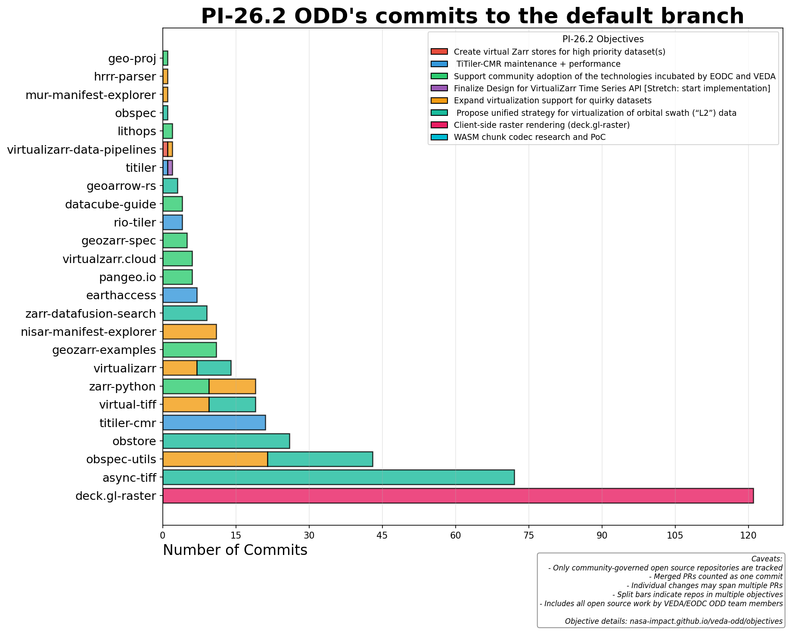

# Quarterly Objectives

This page tracks quarterly objectives and their related repositories across Program Increments (PIs).

## Current PI: 26.2

| # | Objective | Contributors | Repos |
|---|-----------|--------------|-------|
| [#304](https://github.com/NASA-IMPACT/veda-odd/issues/304) | 🤖Create virtual Zarr stores for high priority dataset(s) | tylanderson | virtualizarr-data-pipelines |
| [#305](https://github.com/NASA-IMPACT/veda-odd/issues/305) | 🛠️ TiTiler-CMR maintenance + performance | chuckwondo, hrodmn | titiler, titiler-cmr, python_cmr, earthaccess, rio-tiler |
| [#306](https://github.com/NASA-IMPACT/veda-odd/issues/306) | 🤗 Support community adoption of the technologies incubated b... | chuckwondo, maxrjones, abarciauskas-bgse | geozarr-spec, zarr-python, multiscales, geo-proj, spatial, datacube-guide, geozarr-examples, warp-resample-profiling, pangeo.io, pangeo-docker-images, earthdata-cloud-cookbook, virtualzarr.cloud |
| [#307](https://github.com/NASA-IMPACT/veda-odd/issues/307) | 📈 Finalize Design for VirtualiZarr Time Series API [Stretch:... | hrodmn | titiler, titiler-lambda-layer, titiler-md-demo |
| [#308](https://github.com/NASA-IMPACT/veda-odd/issues/308) | 🤪 Expand virtualization support for quirky datasets | maxrjones | virtualizarr, zarr-python, obspec-utils, virtual-tiff, hrrr-parser, virtualizarr-data-pipelines, nisar-manifest-explorer, mur-manifest-explorer |
| [#309](https://github.com/NASA-IMPACT/veda-odd/issues/309) | 🛰️ Propose unified strategy for virtualization of orbital sw... | sharkinsspatial, maxrjones, hrodmn | virtualizarr, obspec-utils, virtual-tiff, obstore, obspec, zarr-datafusion-search, geoarrow-rs, async-tiff, arrow-zarr |
| [#319](https://github.com/NASA-IMPACT/veda-odd/issues/319) | 🌐 Client-side raster rendering (deck.gl-raster) | kylebarron | - |

---

<details markdown>
<summary>PI 26.1 (5 objectives, 3 closed)</summary>

| # | Objective | State | Contributors |
|---|-----------|-------|--------------|
| [#244](https://github.com/NASA-IMPACT/veda-odd/issues/244) | 🗺️ Add dynamic tiling and timeseries support for V... | open | jbusecke, hrodmn |
| [#245](https://github.com/NASA-IMPACT/veda-odd/issues/245) | 🌍 Add dynamic tiling and timeseries support for da... | open | abarciauskas-bgse, hrodmn |
| [#246](https://github.com/NASA-IMPACT/veda-odd/issues/246) | 🤖 Support virtualization of additional data produc... | closed | sharkinsspatial, maxrjones, jbusecke |
| [#247](https://github.com/NASA-IMPACT/veda-odd/issues/247) | 🛰 Explore scalable, cloud native approaches for se... | closed | sharkinsspatial, kylebarron |
| [#248](https://github.com/NASA-IMPACT/veda-odd/issues/248) | 🤗 Support community adoption of the technologies i... | closed | sharkinsspatial, chuckwondo, maxrjones, abarciauskas-bgse |

</details>

<details markdown>
<summary>PI 25.4 (8 objectives, 7 closed)</summary>

| # | Objective | State | Contributors |
|---|-----------|-------|--------------|
| [#121](https://github.com/NASA-IMPACT/veda-odd/issues/121) | Visualize Web-Optimized Zarr (WOZ) in VEDA (previe... | closed | maxrjones |
| [#122](https://github.com/NASA-IMPACT/veda-odd/issues/122) | Research, develop and document methods for Zarr an... | closed | maxrjones, kylebarron |
| [#197](https://github.com/NASA-IMPACT/veda-odd/issues/197) | 🎬 TiTiler-CMR is production ready | open | abarciauskas-bgse, hrodmn |
| [#198](https://github.com/NASA-IMPACT/veda-odd/issues/198) | 🚀 Dataset support for VEDA instances | closed | maxrjones, jbusecke |
| [#203](https://github.com/NASA-IMPACT/veda-odd/issues/203) | 🗺️Research, develop and document methods for Zarr ... | closed | maxrjones |
| [#204](https://github.com/NASA-IMPACT/veda-odd/issues/204) | 🛠️ Zarr Development | closed | d-v-b, maxrjones |
| [#205](https://github.com/NASA-IMPACT/veda-odd/issues/205) | 🤗 Community engagement | closed | sharkinsspatial, chuckwondo, maxrjones, abarciauskas-bgse |
| [#206](https://github.com/NASA-IMPACT/veda-odd/issues/206) | 📦 Obstore outreach | closed | chuckwondo, kylebarron |

</details>

<details markdown>
<summary>PI 25.3 (6 objectives, 6 closed)</summary>

| # | Objective | State | Contributors |
|---|-----------|-------|--------------|
| [#118](https://github.com/NASA-IMPACT/veda-odd/issues/118) | Support CMR Modernization | closed | sharkinsspatial, kylebarron |
| [#119](https://github.com/NASA-IMPACT/veda-odd/issues/119) | Continue to Build Out the VirtualiZarr Ecosystem | closed | sharkinsspatial, maxrjones |
| [#124](https://github.com/NASA-IMPACT/veda-odd/issues/124) | Publish Cloud-Optimized Datasets | closed | chuckwondo, abarciauskas-bgse |
| [#126](https://github.com/NASA-IMPACT/veda-odd/issues/126) | Support TiTiler-CMR Adoption | closed | sharkinsspatial, hrodmn |
| [#127](https://github.com/NASA-IMPACT/veda-odd/issues/127) | Community Involvement | closed | maxrjones, abarciauskas-bgse, hrodmn |
| [#165](https://github.com/NASA-IMPACT/veda-odd/issues/165) | Foundational Zarr-Python and Xarray Contributions | closed | d-v-b, maxrjones |

</details>

<details markdown>
<summary>PI 25.2 (8 objectives, 8 closed)</summary>

| # | Objective | State | Contributors |
|---|-----------|-------|--------------|
| [#31](https://github.com/NASA-IMPACT/veda-odd/issues/31) | Increase data format support in VirtualiZarr | closed | chuckwondo, maxrjones |
| [#34](https://github.com/NASA-IMPACT/veda-odd/issues/34) | Visualize OCO-3 Datasets in VEDA | closed | abarciauskas-bgse |
| [#35](https://github.com/NASA-IMPACT/veda-odd/issues/35) | Deliver Virtual Zarr Stores for NASA Datasets Usin... | closed | abarciauskas-bgse |
| [#36](https://github.com/NASA-IMPACT/veda-odd/issues/36) | Support for Modernizing VirtualiZarr to use zarr-p... | closed | sharkinsspatial, abarciauskas-bgse |
| [#37](https://github.com/NASA-IMPACT/veda-odd/issues/37) | Support CMR Modernization | closed | sharkinsspatial, kylebarron |
| [#40](https://github.com/NASA-IMPACT/veda-odd/issues/40) | Upgrade titiler and titiler-xarray to zarr-Python ... | closed | maxrjones |
| [#41](https://github.com/NASA-IMPACT/veda-odd/issues/41) | Draft Web-Optimized Zarr (WOZ) Standard | closed | maxrjones |
| [#76](https://github.com/NASA-IMPACT/veda-odd/issues/76) | Demonstrate how to tile HLS using titiler-cmr | closed | hrodmn |

</details>

---

## Visualization

The commits per repository chart uses color-coding to show which objective each repo contributes to. Repos that contribute to multiple objectives are shown with split bars.



---

## Configuration

Objectives are configured in [`reports/config.py`](https://github.com/NASA-IMPACT/veda-odd/blob/main/reports/config.py).

To regenerate this page from config:

```bash
cd reports
uv run generate_docs.py
```

See [FY26 Roadmap](./fy26-roadmap.md) for the broader context of these objectives.